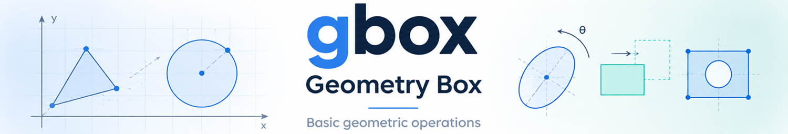

[](https://codecov.io/gh/338rajesh/gbox)
[](https://gbox.readthedocs.io/en/latest/?badge=latest)
[](https://github.com/338rajesh/gbox/actions)

A simple Python package for working with geometry related operations.
See documentation at [gbox.readthedocs.io](https://gbox.readthedocs.io)

## Installation

```bash
pip install --upgrade gbox
```

## Usage

```py

# create 2D points
from gbox import Point2D
>>> p1 = Point2D(0.0, 0.0)
>>> p2 = Point2D(3.0, 4.0)
>>> p1.distance_to(p2)
5.0

# Create a Cirle with center at point and radius 5.0
>>> from gbox import Circle
>>> c1 = Circle(5.0, p1)
>>> c1.area
78.53981633974483
>>> c1.radius
5.0
>>> c1.position
Shape2DPose(x=0.0, y=0.0, orientation=0.0 rad)
>>> c1.bounding_box
[-5.0, -5.0, 5.0, 5.0]

# Working with Angles
>>> from gbox import Angle
>>> import math
>>> g = Angle(math.pi / 4, "rad")
>>> g
Angle(0.7853981633974483, 'rad')
>>> g.degrees
45.0
>>> g == Angle.deg(45)
True
>>> g.cos
0.7071067811865476

# create a ellipse with cetnere at origin, aspect ratio 2 and orientation 45 degrees
>>> import gbox as gb
>>> e = gb.Ellipse(2, 1, major_axis_angle=gb.Angle.deg(45))
>>> e.area
6.283185307179586
>>> e.perimeter
9.688448220547677
>>> e.position
Shape2DPose(x=0.0, y=0.0, orientation=45 deg)
# check point outside the ellipse
>>> e.contains_point((10, 10))
-1
# check point inside the ellipse
>>> e.contains_point((1, 1))
1
# check point on the ellipse
>>> e.contains_point(gb.transform_point_2d(2, 0, angle=gb.Angle.deg(45)))
0  
```

## For Developers

### Install dependencies

Setup environment using [uv](https://docs.astral.sh/uv/)

```bash
# clone the repo, if not done yet
git clone https://github.com/gbox/gbox.git  

# install the uv, if not available, from [uv](https://docs.astral.sh/uv/)

# From the repo root do the following to install the venv
uv sync
```
