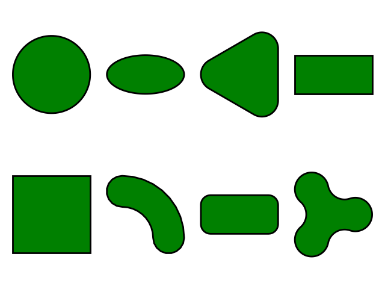

# Geometry Box

A simple python package for geometrical operations.

```python

import geometry_box as gb

circle = gb.Circle(radius=2.0, cent=(3.0, 6.0))
print(circle.area)  # prints circle area
print(circle.perimeter)  # prints circle perimeter
circle.shape_factor()  # returns shape factor: perimeter/equivalent circle perimeter.
circle.eval_locus(num_points=50)  # finds 50 points along the periphery of circle  
circle.eval_locus(num_points=250).plot()  # plots a circle displays using `matplotlib.pyplot.show()`
circle.eval_locus().plot(f_path='/path/to/file')  # saves a plot at the specified path
#
import matplotlib.pyplot as plt

fig, axs = plt.subplots()
circle.eval_locus().plot(axis=axs)  # plots circle on the axs object

```

A sample code for plotting various shapes

```python
import geometry_box as gb
from os import path
import matplotlib.pyplot as plt

fig, axs = plt.subplots(2, 4)
gb.Circle().eval_locus().plot(axis=axs[0, 0])
gb.Ellipse().eval_locus().plot(axis=axs[0, 1])
gb.RegularPolygon(3).eval_locus().plot(axis=axs[0, 2])
gb.Rectangle().eval_locus().plot(axis=axs[0, 3])
gb.BoundingBox2D().eval_locus().plot(axis=axs[1, 0])
gb.CShape().eval_locus().plot(axis=axs[1, 1])
gb.Capsule().eval_locus().plot(axis=axs[1, 2])
gb.NLobeShape(3).eval_locus().plot(axis=axs[1, 3])
plt.tight_layout()
plt.savefig(path.join(path.dirname(__file__), "shapes.pdf"))
plt.close()
```

It produces the following figure




