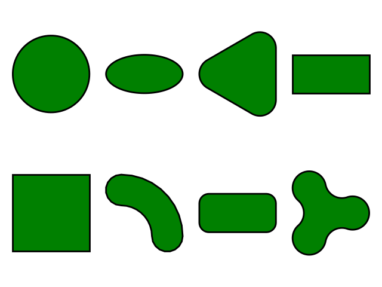

gbox
=====

**gbox** is a simple and small python package intended to perform mathematical operations on elementary shapes.

   A sample collection of shapes plotted using this library

.. toctree::
   :maxdepth: 3
   :caption: Contents:

   Contents <modules>
   usage
   gbox
   gbox.apps

WIP/Goals
----------

#. Convert ``Points(list)`` to ``Points(numpy.ndarray)`` and see if there is any performance gain
#. At present only ``Circle`` and ``Ellipse`` contain the specified number of points on the locus. As, other shapes
   are made up of multiple elements, needs to find the right number of points on each element of the shape.
#. Updating the documentation