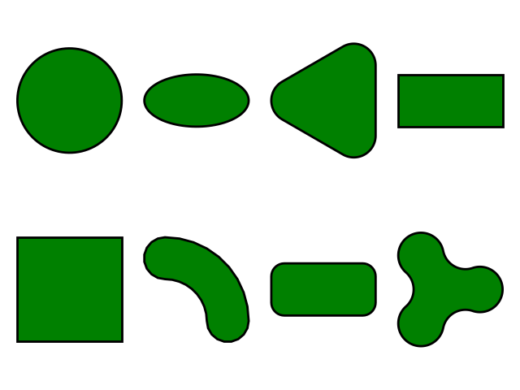

==========
Tutorial
==========

Creating Closed Shapes
----------------------

.. code-block:: python

    import gbox as gb
    from os import path
    import matplotlib.pyplot as plt

    fig, axs = plt.subplots(2, 4)
    gb.Circle().plot(axis=axs[0, 0])
    gb.Ellipse().plot(axis=axs[0, 1])
    gb.RegularPolygon(3).plot(axis=axs[0, 2])
    gb.Rectangle().plot(axis=axs[0, 3])
    gb.BoundingBox2D().plot(axis=axs[1, 0])
    gb.CShape().plot(axis=axs[1, 1])
    gb.Capsule().plot(axis=axs[1, 2])
    gb.NLobeShape(3).plot(axis=axs[1, 3])
    plt.tight_layout()
    plt.savefig(path.join(path.dirname(__file__), "shapes.pdf"))
    plt.close()

It produces the following figure

